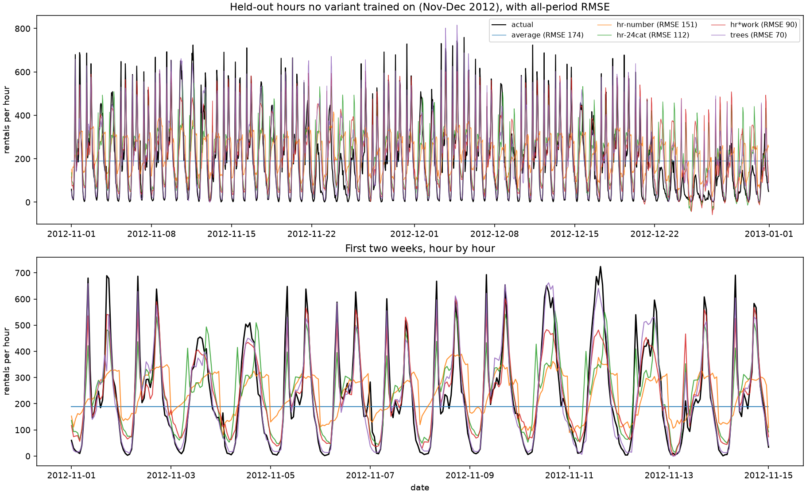

# Two-split bike demand model

One linear regression, trained twice on the same 17,379 hours of bike rentals
(UCI Bike Sharing, 2011-2012). Same features, same model, same metric. The only
thing that changes is how the hours are divided into training and test rows.

The point is not the score. The point is that one of these two scores is a lie,
and the code says which one.

## Result

| Split | Test hours | Mean baseline RMSE | Model RMSE | Model's edge |
|---|---|---|---|---|
| Random 20% of all hours | 3,475 | 182.7 | 141.2 | 23% |
| Everything after 2012-11-01 | 1,460 | 174.4 | 151.0 | 13% |

Shuffling the hours makes the model look 9.8 rentals/hour more accurate than it
is when asked to predict hours it has never seen. Measured against the dumb
baseline on each test set, the model's edge roughly halves: 23% becomes 13%.

That comparison against the baseline is the honest one. The two test sets are
different sets of hours, so 141.2 and 151.0 are not directly comparable on their
own. November and December are quieter and less variable than the full year, so
even the baseline's error changes between splits. Improvement over the baseline
is the number that survives that difference.

## Run it

```
python -m venv .venv
.venv\Scripts\python.exe -m pip install -r requirements.txt
.venv\Scripts\python.exe -m pip install --no-build-isolation -e .
.venv\Scripts\python.exe -m bike_demand.download
.venv\Scripts\python.exe -m bike_demand.run
.venv\Scripts\python.exe -m bike_demand.explain
.venv\Scripts\python.exe -m pytest
```

`run` prints both splits and writes `outputs/time_split_forecast.png`.

`explain` puts all five variants on one page for a random held-out day. It
breaks that day's busiest prediction into one line per feature, compares what
every variant predicted for that hour, then prints the whole day hour by hour
with one column per variant. Pin it when you want the same output twice:

```
python -m bike_demand.explain --seed 3          reproduce a particular random day
python -m bike_demand.explain --day 2012-12-20  pick the day
python -m bike_demand.explain --hour 3          pick the hour to break down
```

`ablation` trains the same five variants and prints the summary table in the
next section.

One day of `explain` output, with the fixes arriving column by column:

```
   hr  actual   average hr-number  hr-24cat   hr*work     trees   actual shape
    3       4       189       136        56        46        16   
    8     599       189       174       405       519       639   ###############
   17     475       189       264       481       541       486   ############
   23      13       189       302       111       107        65   
  ----------------------------------------------------------------------------
         RMSE     163.1     166.3      95.1      89.9      47.6
```

At 3am and 11pm the `hr-number` column is absurd (136 and 302 bikes when 4 and
13 went out) because a single coefficient on `hr` can only slope upward. At 8am
the same column reads 174 against 599. Every later column fixes one of those.

## Why the random split flatters the model

Rentals at 8am and 9am on the same Tuesday are nearly the same number. A random
split puts 8am in training and 9am in the test set, so the model is scored on
hours whose neighbours it already memorised. Nothing in the code is broken; the
test set simply is not a test of forecasting.

The time split asks the real question: given 2011 through October 2012, what
happens in November and December? No test hour has a neighbour in training.

```
random split   | ####  ##  ####  # ###  ##  #### |  train and test interleaved
time split     | ############################ ## |  train, then test
```

## What the plot shows



Black is what actually happened. The flat line at 189 is the mean baseline, and
`hr-number` is the plain linear model discussed above: it tracks the slow decline
into winter and knows daytime beats 3am, but it badly misses the shape of a
weekday. Actual demand spikes twice, at the morning and evening commutes,
reaching 700 rentals in an hour, while `hr-number` is a smooth hump that never
exceeds about 400.

The zoom panel is where the variants separate. `hr*work` and `trees` trace the
double peak closely and drop to near zero overnight. `hr-24cat` gets the shape
but overshoots the quiet midday hours on weekends, which is the interaction it
cannot express.

That is underfitting, and the cause is visible in the feature list. `hr` enters
the model as one number from 0 to 23 with one coefficient, so the model can only
express "rentals rise steadily through the day." It cannot represent two peaks
with a lull between them. The fix is to change the representation, not the
algorithm: treat `hr` as 24 separate categories, or add sine and cosine terms.

`python -m bike_demand.explain` shows the fitted numbers behind that sentence.
The `hr` coefficient is +7.77, so the model can move demand by at most about 180
rentals across a whole day, and only upward. On 2012-11-05 the real day ran from
4 rentals at 3am to 648 at 8am. The `workingday` coefficient is +2.45, which is
the same problem in a second form: the commute spike happens only on working
days, and a model with no interaction term cannot say "busy at 8am, but only on
a weekday."

## Fixing it, one change at a time

`python -m bike_demand.ablation` trains five variants on the same time split.
Every row changes exactly one thing from the row above, so each improvement has
a cause. `night` is hours 0-5, `rush` is 7, 8, 17 and 18, and `neg` counts
predictions below zero rentals.

```
  model                               RMSE  vs base   night    rush   neg
  -----------------------------------------------------------------------
  mean baseline                      174.4      0%   167.6   284.2     0
  linear, hour as a number           151.0     13%   107.6   247.5     1
  linear, hour as 24 categories      112.1     36%    53.3   199.2    17
  linear, hour x workingday           89.7     49%    51.1   139.2    20
  gradient boosted trees              70.3     60%    21.8   116.5     2
```

**Giving each hour its own coefficient cuts the night error in half** (107.6 to
53.3) and overall RMSE by a quarter, with the same algorithm and the same 15,919
training rows. The only change is that `hr` stops being one number with one
coefficient and becomes 24 indicator columns. A model that can say "3am is its
own thing" no longer has to route the night through a single upward slope.

**Crossing hour with `workingday` is what fixes rush hour** (199.2 to 139.2).
The commute spike is a fact about 8am *on a working day*, which a sum of
independent terms cannot state no matter how well each term is fitted. This is
the row that repairs the holiday failure described below.

**Gradient boosted trees win on every column** while needing none of the
encoding above, because a tree splits on `hr < 6` and `workingday == 1` by
itself. Note where the credit belongs: of the total improvement from 151.0 to
70.3, feature encoding delivered 76% of it and the change of algorithm the
remaining 24%. The representation mattered more than the model class.

The `neg` column is the linear models' parting flaw. The more freedom they get
to push night hours down, the more often they land below zero rentals, which is
impossible. Predicting `log(1 + cnt)` instead of `cnt` would rule that out.

### The split still decides the story

A stronger model does not rescue a careless split. It makes it worse:

| Model | Random split | Time split |
|---|---|---|
| linear, hour as a number | 23% over baseline | 13% over baseline |
| gradient boosted trees | 76% over baseline | 60% over baseline |

In absolute terms the trees score 43.5 RMSE on a random split and 70.3 on the
future. **The flexible model gains more from a bad split than the weak one
does**, because extra capacity is exactly what lets it exploit the fact that
8am and 9am on the same Tuesday are nearly the same number. Model capacity and
evaluation leakage compound.

## The ideas this project is built to demonstrate

**Supervised learning.** Twelve columns describing an hour go in (`season`,
`yr`, `mnth`, `hr`, `holiday`, `weekday`, `workingday`, `weathersit`, `temp`,
`atemp`, `hum`, `windspeed`), and the rental count `cnt` comes out. Fitting
means choosing coefficients that minimise squared error on the training rows
only. See `src/bike_demand/train.py`.

**Leakage.** `casual` and `registered` are the rental count split by user type,
and they add up exactly to `cnt`. A model given either one scores almost
perfectly and has learned nothing. They are excluded in
`src/bike_demand/data.py`, and `tests/test_leakage_and_splits.py` asserts both
that they sum to the target and that they never reach the model.

**A baseline.** "Always predict the training average" is a legitimate
competitor. Without it, 141.2 RMSE is a number with no meaning. With it, you
know training bought you 23% on one split and 13% on the other. Any result
without a baseline beside it is unreadable.

**Train error versus test error.** On the time split the model scores 141.2 on
its own training hours and 151.0 on the future. The first number describes how
well it fitted rows it was handed. Only the second says anything about hours it
has not seen, and only that one goes on a slide.

**The split is a modelling decision.** It is not setup, and it is not a
formality. It is the choice that determines whether your evaluation answers the
question you care about. Here it moves the headline result by 10 percentage
points, with the model and features untouched.

## Layout

```
src/bike_demand/data.py      features, target, and the excluded columns
src/bike_demand/splits.py    random split and time split
src/bike_demand/train.py     mean baseline and linear regression
src/bike_demand/evaluate.py  RMSE and the per-split report
src/bike_demand/run.py       entry point: both splits, printout, plot
src/bike_demand/explain.py   one hour and one day, all five variants side by side
src/bike_demand/models.py    the five ablation variants
src/bike_demand/ablation.py  trains all five on the honest split, prints the table
src/bike_demand/download.py  fetch hour.csv from UCI
tests/                       split, leakage, and model-variant guards
```

## Honest limits

Linear regression on raw hourly features is a deliberately plain model, chosen
so the split is the only moving part in the headline comparison. It underfits
the commute pattern, as the plot shows. The ablation section above measures how
far that can be pushed: 70.3 RMSE with trees against 151.0 for the plain model,
and the random-split gap is wider for the stronger model, not narrower.

The ablation reports a single number per variant on one test period, so small
differences between adjacent rows should not be over-read. The jumps here are
large enough to survive that caveat; a proper treatment would use a rolling
cutoff and report spread.

The time split uses a single cutoff. Real forecasting evaluation usually rolls
the cutoff forward repeatedly and averages, so one lucky or unlucky test period
cannot decide the result.

Data: [UCI Bike Sharing Dataset](https://archive.ics.uci.edu/dataset/275/bike+sharing+dataset)
(Fanaee-T and Gama, 2013). Hourly rentals from Capital Bikeshare, Washington DC.
